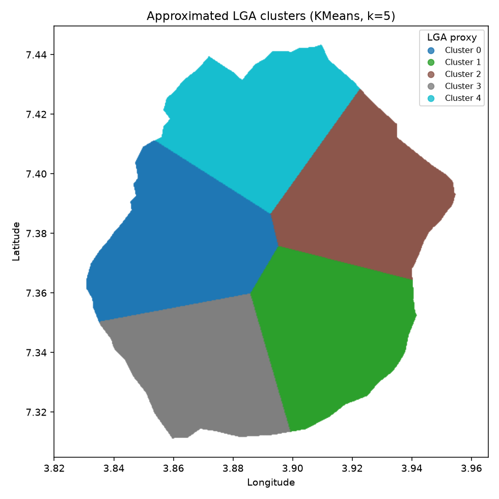

# 02 — Split strategy

## Spatial leave-one-cluster-out
- KMeans(k=5) on raw (lon, lat), seed=42. Approximates the 5 LGAs of Ibadan metropolis since the dataset lacks an explicit LGA column. Under this regime we run 5 folds; each fold holds one cluster out as the test set.

### Cluster composition
| cluster | n | share | centroid (lon, lat) | No_Flood | Low | Moderate | High | Very_High |
|---:|---:|---:|---|---:|---:|---:|---:|---:|
| 0 | 30,821 | 21.3% | (3.8622, 7.3769) | 3,417 | 6,863 | 8,090 | 7,358 | 5,093 |
| 1 | 29,471 | 20.4% | (3.9124, 7.3473) | 3,343 | 6,757 | 7,783 | 6,879 | 4,709 |
| 2 | 29,027 | 20.1% | (3.9239, 7.3923) | 3,143 | 6,338 | 7,610 | 7,092 | 4,844 |
| 3 | 26,085 | 18.1% | (3.8702, 7.3349) | 2,967 | 5,833 | 6,964 | 6,191 | 4,130 |
| 4 | 28,997 | 20.1% | (3.8883, 7.4177) | 3,256 | 6,461 | 7,669 | 6,931 | 4,680 |

Cluster map: 

## Random stratified 80/20
- Simple `train_test_split(test_size=0.2, stratify=y, random_state=42)`. Class balance is preserved by construction. Used *only* for the accuracy-gap comparison against the spatial regime — not as the primary evaluation.
- Train n=115,520, Test n=28,881

## Why report both
A random split lets each cluster contribute rows to both train and test, so the model can memorise local geography. The spatial split asks the harder question the app actually faces: *given a hydro-topographic profile from an unseen area, can we still classify risk?* The gap between the two scores is the single most honest number in the eval and will be reported prominently in the thesis.