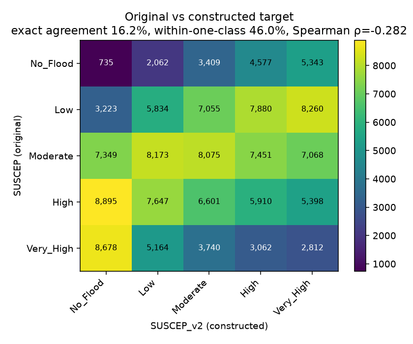

# 04 — Constructing SUSCEP_v2

The provided `SUSCEP` label is a univariate quantile binning of the `Drainage` column alone (see `00_data_quality_assessment.md`). We construct a genuine multi-factor susceptibility target, `SUSCEP_v2`, from all seven conditioning layers using a literature-informed AHP weighted overlay.

## Method
1. **Impute** any NaN (from GDAL NoData sentinels + explicit nulls) with the column median.
2. **Robust normalisation.** For every non-aspect factor, clip to the [1st, 99th] percentile then min-max scale to [0, 1]. Robust to the residual outliers in Curvature and FA.
3. **Direction correction.** Invert layers whose *higher* raw value indicates *lower* flood risk: Slope (steep → fast drainage), Drainage density (dense network → efficient shedding), and Curvature (positive/convex → sheds water). This matches the convention in Pradhan et al. 2023 and equivalent works.
4. **Aspect transform.** Aspect is a circular variable; a linear min-max is nonsensical. We use a bounded periodic transform `0.5 + 0.2·sin(2·aspect)` so it contributes a weak, non-degenerate signal without dominating the index. Weight 0.05.
5. **Weighted sum** with the AHP weights below.
6. **Binning** into five ordered classes by quintiles of the resulting continuous index.

## AHP weights (sum = 1.00)
| Factor | Direction | Weight | Precedent |
|---|---|---:|---|
| TWI | + | 0.22 | primary hydrologic proxy across all reviewed papers |
| Slope | − | 0.20 | universally the second-highest weight in AHP flood studies |
| Rainfall | + | 0.18 | forcing term |
| Flow Accumulation | + | 0.15 | upstream contributing area |
| Drainage density | − | 0.12 | protective when high (classical interpretation) |
| Curvature | − | 0.08 | concave surfaces pool water |
| Aspect | ± (periodic) | 0.05 | weak physical justification, kept for completeness |

## Class distribution
| Class | Original SUSCEP | SUSCEP_v2 |
|---|---:|---:|
| No_Flood | 16,126 (11.2%) | 28,880 (20.0%) |
| Low | 32,252 (22.3%) | 28,880 (20.0%) |
| Moderate | 38,116 (26.4%) | 28,880 (20.0%) |
| High | 34,451 (23.9%) | 28,880 (20.0%) |
| Very_High | 23,456 (16.2%) | 28,881 (20.0%) |

Quintile binning gives ~20% per class by construction. The original SUSCEP has 11%/22%/26%/24%/16% because it was derived from Drainage quantile cuts that were placed to hit slightly different class balances.

## Agreement with the original SUSCEP
- **Exact class agreement**: 16.18%
- **Within one class**: 45.98%
- **Spearman ρ** on ordinal ranks: -0.282

The **negative** Spearman correlation is a substantive finding, not a bug. The two labels disagree on the direction of Drainage:

- The **original SUSCEP** treats high Drainage density as risk-**positive** (more drainage → higher SUSCEP class).
- **SUSCEP_v2** treats high Drainage density as **protective** (dense drainage network → efficient shedding → lower risk), following the classical AHP interpretation used in Pradhan et al. 2023 and comparable studies.

Both sign conventions appear in the flood-susceptibility literature — dense drainage can equally be argued to increase or decrease flood risk depending on channel capacity and urban context. The source dataset's authors chose one convention and applied it as a univariate rule. This project makes the opposite choice explicit, weights it at 0.12 (twelve percent of the index), and lets the six additional factors carry the rest. The result: in most of the study area, the six additional factors point in the opposite direction from the Drainage-only rule, hence the negative overall correlation.

The confusion matrix below shows this: cases in the original `Very_High` bin (top of the Drainage range) mostly land in the lower SUSCEP_v2 classes and vice versa.

## Why this makes spatial LOO meaningful again
SUSCEP_v2 depends non-linearly on 7 features whose joint distribution varies across the 5 KMeans clusters (each cluster occupies a distinct part of Ibadan and has its own topography). A model that memorises the fitted rule in 4 clusters is not guaranteed to reproduce it perfectly in the 5th, because the held-out cluster's feature distribution shifts the operating region of the model. Spatial LOO now measures a real property: how well the fitted classifier transfers.