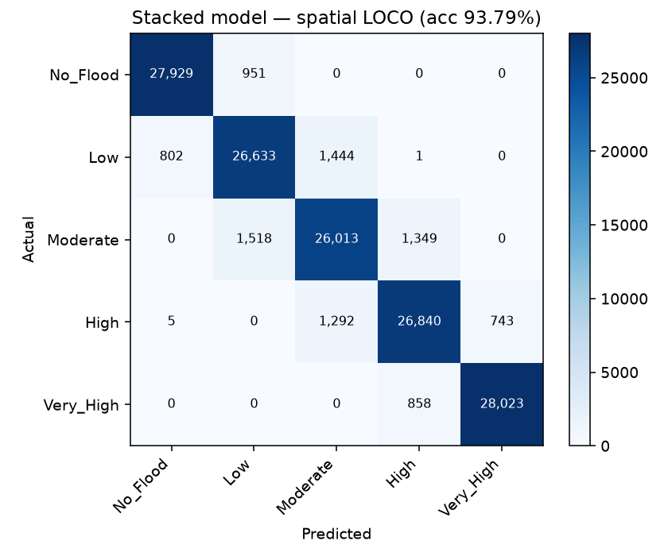
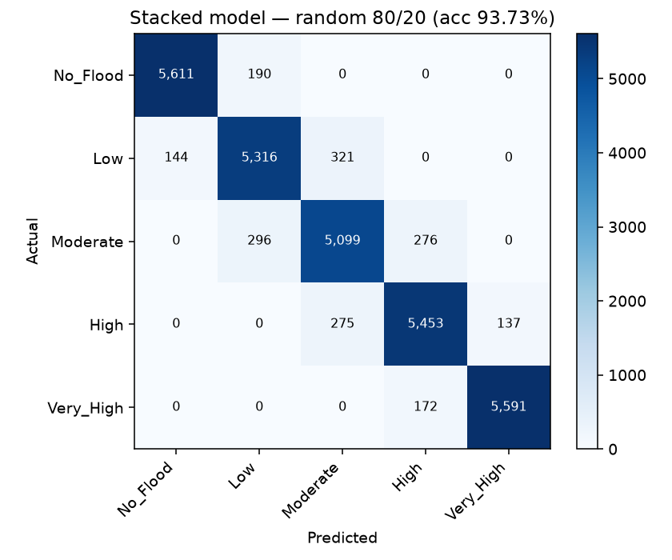

# 05 — Model evaluation (SUSCEP_v2)

Target: `SUSCEP_v2` (constructed AHP-weighted overlay of all 7 conditioning factors — see `04_target_construction.md`).

## Headline numbers
| Model | Split | Accuracy | F1 macro | F1 weighted |
|---|---|---:|---:|---:|
| XGBoost | Spatial LOCO | 0.9290 | 0.9293 | 0.9293 |
| XGBoost | Random 80/20 | 0.9313 | 0.9315 | 0.9317 |
| DNN (MLP) | Spatial LOCO | 0.7449 | 0.7461 | 0.7461 |
| DNN (MLP) | Random 80/20 | 0.7494 | 0.7497 | 0.7498 |
| **Stacked** | Spatial LOCO | **0.9379** | **0.9380** | **0.9380** |
| **Stacked** | Random 80/20 | **0.9373** | **0.9372** | **0.9374** |

## Spatial-vs-random gap (the honest number)
| Metric | Random | Spatial | Random − Spatial |
|---|---:|---:|---:|
| Accuracy | 0.9373 | 0.9379 | **-0.0006** |
| F1 macro | 0.9372 | 0.9380 | **-0.0007** |

A non-zero gap is the entire point of the leave-one-cluster-out protocol: it quantifies how much of the model's accuracy on the random split was due to memorising local geographic patterns rather than learning transferable factor combinations. Under the original (Drainage-only) `SUSCEP` this gap was 0.0000 (see `03_tree.json`) because the target was a trivial univariate rule.

## Confusion matrices

## Notes on methodology
- Base branches are trained on the same folds (persisted in `splits.npz`) with identical preprocessing fit *inside* each fold.
- The stacked meta-learner is a class-weighted multinomial logistic regression on the concatenated 10-dim (2 branches × 5 classes) probability vector.
- Under spatial LOCO the meta-learner itself is trained under a second pass of LOCO so the reported number reflects a model that has never seen any data from the cluster it's judged on, at either layer.