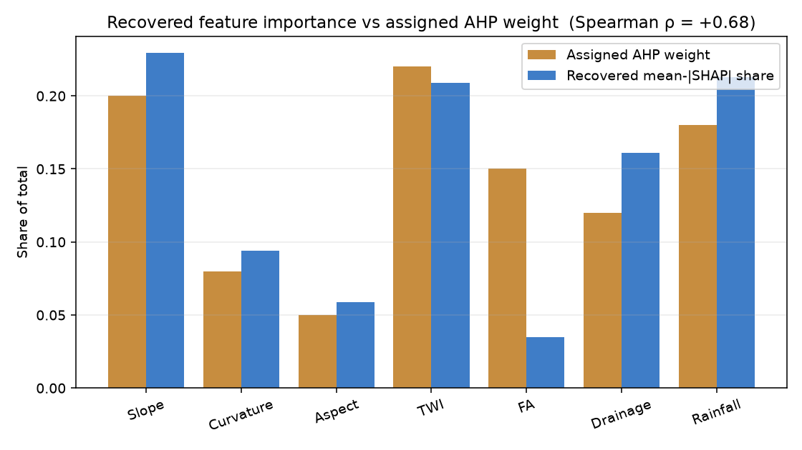

# 08 — SHAP validation of the constructed target

If the XGBoost model has truly learned SUSCEP_v2 from the seven conditioning factors, the mean-|SHAP| share it attributes to each feature should track the AHP weights we used to construct SUSCEP_v2 in the first place. Any large disagreement would flag either a bug in the construction, a bug in the model, or that the model has found a non-obvious interaction we did not account for.

## Feature-importance table
| Feature | Assigned AHP weight | Recovered mean-|SHAP| share |
|---|---:|---:|
| Slope | 0.200 | 0.229 |
| Curvature | 0.080 | 0.094 |
| Aspect | 0.050 | 0.059 |
| TWI | 0.220 | 0.209 |
| FA | 0.150 | 0.035 |
| Drainage | 0.120 | 0.161 |
| Rainfall | 0.180 | 0.213 |

- Spearman ρ(recovered, assigned) = **+0.679**
- Pearson r(recovered, assigned)  = **+0.741**

## Per-class SHAP shares
| Feature | No_Flood | Low | Moderate | High | Very_High |
|---|---:|---:|---:|---:|---:|
| Slope | 0.207 | 0.246 | 0.240 | 0.214 | 0.249 |
| Curvature | 0.111 | 0.093 | 0.066 | 0.086 | 0.090 |
| Aspect | 0.075 | 0.057 | 0.014 | 0.056 | 0.060 |
| TWI | 0.179 | 0.201 | 0.277 | 0.227 | 0.211 |
| FA | 0.018 | 0.029 | 0.041 | 0.047 | 0.047 |
| Drainage | 0.180 | 0.165 | 0.143 | 0.160 | 0.146 |
| Rainfall | 0.230 | 0.209 | 0.218 | 0.210 | 0.197 |

The per-class shares show which factors most influence membership of each risk class. Residents whose home falls in a `High` / `Very_High` class typically get an explanation that highlights the top-|SHAP| factors *for their specific point* — see `explain.py`.